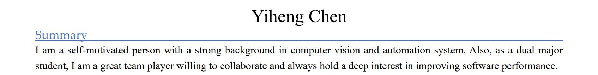
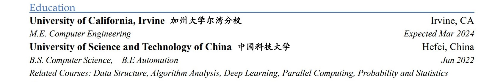
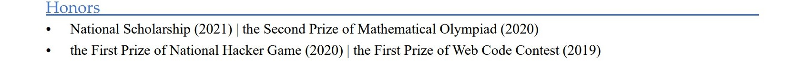
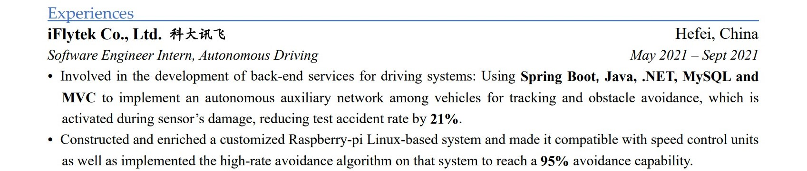
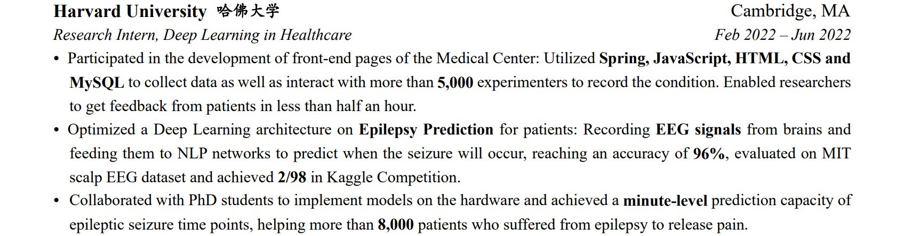
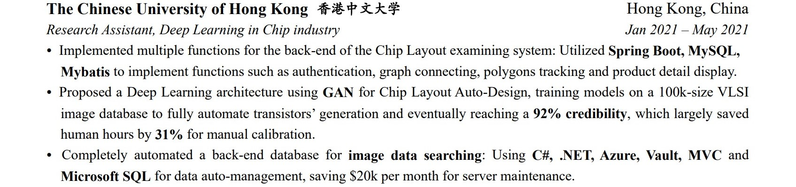
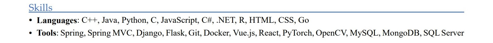

Yiheng Chen

Summary	

I am a self\-motivated person with a strong background in computer vision and automation system\. Also, as a dual major student, I am a great team player willing to collaborate and always hold a deep interest in improving software performance\.

Experiences	  

__iFlytek Co\., Ltd\. 科大讯飞__	Hefei, China

*Software Engineer Intern, Autonomous Driving*	*May 2021 – Sept 2021*__                                              __

• Involved in the development of back\-end services for driving systems: Using __Spring Boot, Java, \.NET, MySQL and MVC__ to implement an autonomous auxiliary network among vehicles for tracking and obstacle avoidance, which is activated during sensor’s damage, reducing test accident rate by __21%__\.

• Constructed and enriched a customized__ __Raspberry\-pi Linux\-based system and made it compatible with speed control units as well as implemented the high\-rate avoidance algorithm on that system to reach a __95% __avoidance capability\.

__Harvard University 哈佛大学__	Cambridge, MA

*Research Intern, Deep Learning in Healthcare*	*Feb 2022 – Jun 2022*__                                              __

• Participated in the development of front\-end pages of the Medical Center: Utilized __Spring, JavaScript, HTML, CSS and MySQL__ to collect data as well as interact with more than __5,000__ experimenters to record the condition\. Enabled researchers to get feedback from patients in less than half an hour\. 

• Optimized a Deep Learning architecture on __Epilepsy Prediction__ for patients: Recording __EEG signals__ from brains and feeding them to NLP networks to predict when the seizure will occur, reaching an accuracy of __96%__, evaluated on MIT scalp EEG dataset and achieved __2/98__ in Kaggle Competition\.

•	Collaborated with PhD students to implement models on the hardware and achieved a __minute\-level__ prediction capacity of epileptic seizure time points, helping more than __8,000__ patients who suffered from epilepsy to release pain\. 

__The Chinese University of Hong Kong 香港中文大学__	Hong Kong, China

*Research Assistant, Deep Learning in Chip industry*	*Jan 2021 – May 2021*

• Implemented multiple functions for the back\-end of the Chip Layout examining system: Utilized __Spring Boot, MySQL,__

__Mybatis__ to implement functions such as authentication, graph connecting, polygons tracking and product detail display\. 

• Proposed a Deep Learning architecture using __GAN__ for Chip Layout Auto\-Design, training models on a 100k\-size VLSI image database to fully automate transistors’ generation and eventually reaching a __92% credibility__, which largely saved human hours by __31%__ for manual calibration\.

• Completely automated a back\-end database for __image data searching__: Using __C\#, \.NET, Azure, Vault, MVC__ and __Microsoft SQL__ for data auto\-management, saving $20k per month for server maintenance\.	

Skills	

__• Languages__: C\+\+, Java, Python, C, JavaScript, C\#, \.NET, R, HTML, CSS, Go 

• __Tools__: Spring, Spring MVC, Django, Flask, Git, Docker, Vue\.js, React, PyTorch, OpenCV, MySQL, MongoDB, SQL Server

Education	

__University of California, Irvine 加州大学尔湾分校__	Irvine, CA

*M\.E\. Computer Engineering*	*Expected Mar 2024*__                                              __

__University of Science and Technology of China 中国科技大学__	Hefei, China

*B\.S\. Computer Science,  B\.E Automation                                                           Jun 2022*

*Related Courses: Data Structure, Algorithm Analysis, Deep Learning, Parallel Computing, Probability and Statistics*

Honors	

- National Scholarship \(2021\) | the Second Prize of Mathematical Olympiad \(2020\)
- the First Prize of National Hacker Game \(2020\) | the First Prize of Web Code Contest \(2019\)	

